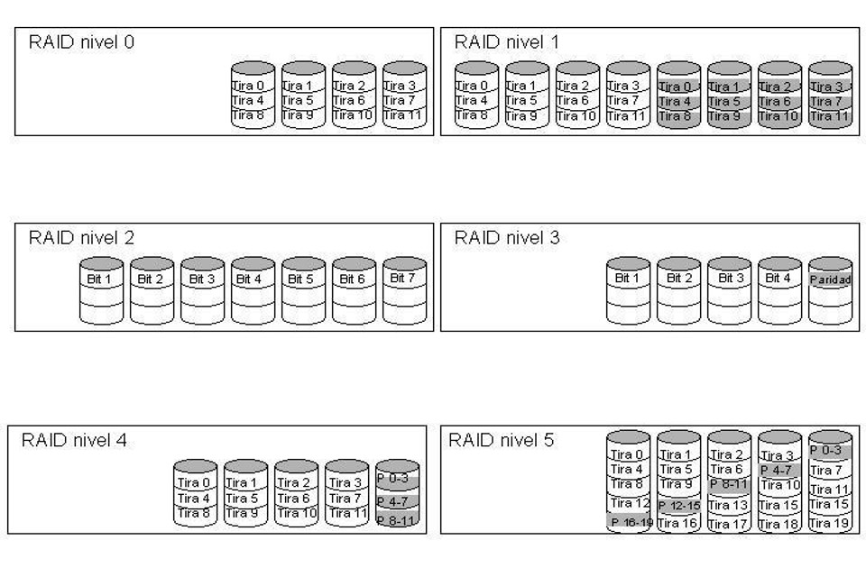

# Sistemas RAID

Los discos duros son las unidades de almacenamiento interno que conectas a la placa base de tu ordenador para poder almacenar cosas. Por lo general, la mayoría de usuarios solemos hacer las conexiones de forma directa, simplemente conectando los discos duros a la placa base para que funcionen por separado, cada uno con su propia capacidad de almacenamiento.

Pero si el método tan sencillo se te queda corto, también puedes recurrir a una configuración RAID. El nombre son las siglas de Redundant Array of Independent Disks o Matriz redundante de discos independientes, y es un método para combinar los discos duros como un matriz que se reconoce como una sola unidad por el sistema operativo. Dicho de forma sencilla, sería como configurar una unidad de almacenamiento formada por varios discos duros.

Lo que hace esta configuración es enlazar los datos en varios discos duros, haciendo que las operaciones de entrada y salida de datos estén mejor balanceadas, lo que al final acaba ayudando a tener un mejor rendimiento.

Es lo que llamamos una forma de almacenar datos distribuida por utilizar varios discos duros, y también redundante porque habrá veces en la que estos datos se escriban en varios discos duros a la vez. Esto dependerá del tipo de RAID que configures, ya que hay otras veces en las que los datos se repartirán en los diferentes tipos duros para que así también se repartan el trabajo entre ellos.

## Funcionamiento

Cada tipo de RAID tiene sus propias características y su forma de funcionar. Por lo general, estas configuraciones suelen utilizarse sobre todo en servidores para mejorar el rendimiento de los discos y evitar la pérdida de los datos almacenados. Pero también suele utilizarse en servidores NAS domésticos, pudiendo elegir entre usar los dos discos duros uno junto al otro para ampliar el almacenamiento o uno duplicando otro para evitar pérdida de datos.

Existen diferentes tipos de configuraciones RAID a las que se puede optar dependiendo de los resultados que se quiera obtener en seguridad y rendimiento. Puedes optar entre más de 15 tipos diferentes, aunque nosotros hoy vamos a centrarnos en decirte únicamente los más populares y comunes junto a sus características y las ventajas que ofrecen.

## Niveles

Los niveles RAID son formas de organización específicas en que se operan los sistemas RAID.

Existen desde el nivel RAID 0 hasta el nivel RAID 5, cada uno de los cuales tiene ventajas e inconvenientes específicos, por lo que su aplicación en determinada computadora dependerá en buena medida de la aplicación que se le valla a dar en función de tasa de transferencia, velocidad de grabación o seguridad de datos

### RAID 0

Esta es una de las configuraciones básicas de RAID, y una de las principales configuraciones para quien busca velocidad de escritura y lectura por encima de todo, ya que esta velocidad se multiplica exponencialmente debido a la manera en la que se distribuyen los datos en los discos que la forman.

Necesitarás al menos dos discos que pueden ser de diferentes capacidades, aunque la matriz tomará como referencia el de menor capacidad. Por lo tanto, si tienes un disco de 1TB y otro de 500 GB, no se formará una matriz de 1,5 TB, ya que al tomarse como referencia el de menor capacidad, serán 500 + 500 GB, por lo tanto, la matriz tendrá una capacidad de 1 TB.

La información se escribe de forma alterna en cada uno de los discos que forman la matriz. Esto hace que los datos se envíen de forma paralela, y que la velocidad a la que fluyen los datos pueda llegar a ser literalmente el doble que si tuviéramos sólo un disco. La parte negativa es que los datos no se van a duplicar, y al no haber redundancia, si hay un fallo en un disco o en algún archivo interno, perderás los datos sin poder recuperarlos.

### RAID 1

Es otra de las configuraciones básicas de RAID, en la que prima la redundancia de datos. Vas a necesitar al menos dos discos duros para utilizarla, y los datos se almacenan por igual en cada uno de los discos duros. Por lo tanto, si hay algún error en alguno de los discos o en alguno de los archivos, siempre tendrás otra copia a la que recurrir.

Esto también quiere decir que el tamaño de la matriz es el mismo que el disco duro de menor capacidad, ya que los datos tienen que estar siempre por duplicado. Si tienes un disco de 1 TB y otro de 500 GB, la matriz tendrá una capacidad de 500 GB. Esto es así porque es hasta 500 GB que vas a poder tener los datos duplicados, la capacidad de uno de los discos.

Además de la seguridad y tranquilidad que te dará tener los datos duplicados, el hecho de que en ambos discos puedan encontrarse los mismos datos hace que cada uno pueda transmitir la información de forma simultánea, por lo que también se va a incrementar exponencialmente la velocidad de escritura y lectura dependiendo de la cantidad de unidades que tengas.

### RAID 2

Distribuye los datos entrelazadas a nivel de bit. El código de error se intercala a través de varios discos también a nivel de bit, el código de error se calcula con el código de Hamming. Todo giro del cabezal de disco se sincroniza y los datos se distribuyen en bandas de modo que cada bit secuencial está en una unidad diferente. La paridad de Hamming se calcula a través de y los bits correspondientes y se almacena en al menos un disco de paridad. Este nivel es solo significante a nivel histórico y teórico, ya que actualmente no se utiliza.

### RAID 3

Un RAID 3 usan "data striping" con un disco de paridad dedicado. divide los datos al nivel de bytes. Permite tasas de transferencias extremadamente altas. Un RAID 3 necesitaría un mínimo de tres discos, utilizando uno para datos de paridad. En estos se copian los datos en distribución RAID 0 en los 2 primeros discos, sin embargo, en el tercer disco, se crea el byte de paridad. Esto quiere decir que si por ejemplo perdemos un byte de uno de los discos, siempre podremos recuperarlo mediante el byte de paridad que se ha generado anteriormente.

En el ejemplo del gráfico, una petición del bloque «A56» formado por los bytes Ah1 a Af6 requeriría que los tres discos de datos buscaran el comienzo (Ag1) y devolvieran su contenido. Una petición simultánea del bloque «Bh» en el cual guarda la suma de los números de un archivo y en caso de pérdida de datos se hace la diferencia con la suma o la multiplicación incluso.

RAID niveles 2 y 3 requieren una perfecta sincronización en la lectura.

### RAID 4

Un RAID 4, también conocido como IDA (acceso independiente con discos dedicados a la paridad), usa división a nivel de bloques con un disco de paridad dedicado. Necesita un mínimo de 3 discos físicos. El RAID 4 es parecido al RAID 3 excepto porque divide a nivel de bloques en lugar de a nivel de bytes. Esto permite que cada miembro del conjunto funcione independientemente cuando se solicita un único bloque. Si la controladora de disco lo permite, un conjunto RAID 4 puede servir varias peticiones de lectura simultáneamente. En principio también sería posible servir varias peticiones de escritura simultáneamente, pero al estar toda la información de paridad en un solo disco, este se convertiría en el cuello de botella del conjunto.

En el gráfico de ejemplo anterior, una petición del bloque «A1» sería servida por el disco 0. Una petición simultánea del bloque «B1» tendría que esperar, pero una petición de «B2» podría atenderse concurrentemente.

### RAID 5

Otra de las configuraciones RAID más utilizadas, en la que debes tener un mínimo de 3 discos duros. Su funcionamiento es algo más complejo, pero podemos decir que los datos se distribuyen entre todos los discos que tengas en la matriz salvo en uno, que almacenará una copia de los datos a forma de copia de seguridad.

En cuanto al resto de discos más allá del de copia de seguridad, la información se divide en bloques que se distribuyen de forma equitativa por ellos. Así, se multiplica exponencialmente la velocidad, y cuantos más discos duros tengas mayor será la velocidad, aunque no será

Salvando las distancias técnicas, es como una especie de mezcla de los dos tipos anteriores, ya que la velocidad se multiplica al repartirse los datos entre los discos, pero si hay algún fallo también tendrás un disco de soporte desde el que puedes recuperar los datos.

Sin embargo hay dos partes negativas. La primera es que el mínimo de discos duros necesarios es de 3 en vez de 2 como la configuración inicial, algo que representa una inversión mayor. Y la segunda es que si dos discos fallan, uno de ellos el que almacena la copia de los datos, sigues pudiendo perder datos aunque otro siga funcionando.

